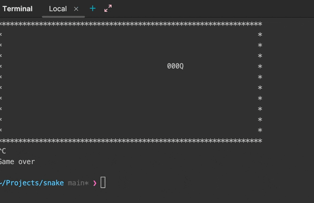

# snake

Demo project to learn development on python and raspberry pi

### Demo



# How to run

on Linux / Mac
```bash
sudo python ./main.py
```

or on Windows use Admin cmd
```bash
python ./main.py
```
