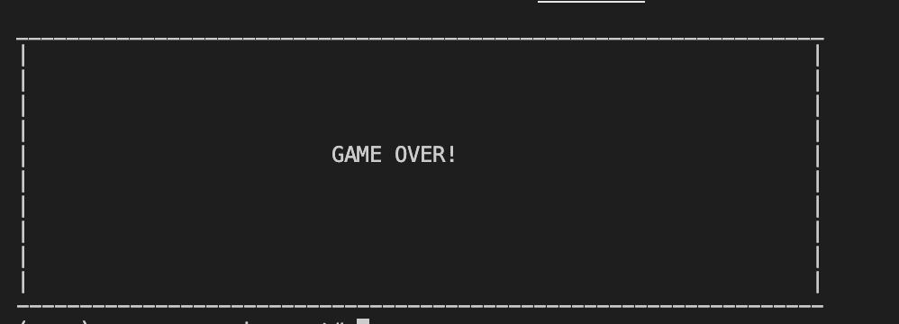
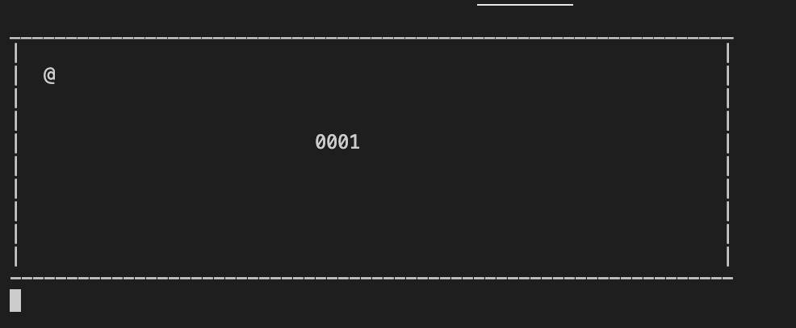

# Snake game

Demo project to learn development on python and raspberry pi

## Development steps

1. Develop playable game in console. During development try stick to pure python tools.
2. Migrate code to MicroPython.

### Demo

[Full demo video is here](./docs/demo.mp4)

#### Screens




## How to run

Create virtual env for python
```bash
python -m venv venv
```

```bash
source venv/bin/activate
```

Install requirements
```bash
pip install -r requirements.txt
```

Then run on Linux / Mac
```bash
sudo python ./main.py
```

or on Windows use Admin cmd
```bash
python ./main.py
```
